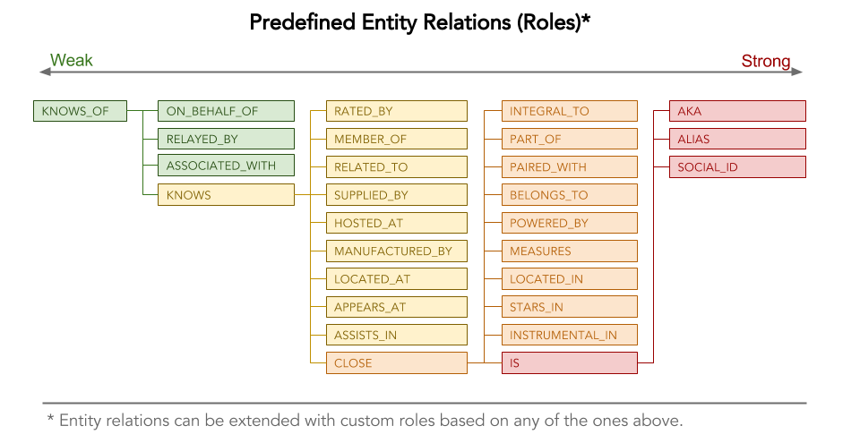

# Activity Stream :: AS Event Relations (Roles) 

## Introduction

##Diagram

### IS
### AKA
### ALIAS
### SOCIAL_ID

## CLOSE
### INTEGRAL_TO
### PART_OF
### PAIRED_WITH
### BELONGS_TO
### POWERED_BY
### MEASURES
### LOCATED_IN
### STARS_IN
### INSTRUMENTAL_IN

## KNOWS
### REATED_BY
### MEMBER_OF
### RELATED_TO
### SUPPLIED_BY
### HOSTED_AT
### MANUFACTURED_BY
### LOCATED_AT
### APPEARS_IN
### ASSISTS_IN

## KNOWS_OF
### ON_BEHALF_OF
### RELAYED_BY
### ASSOCIATED_WITH

